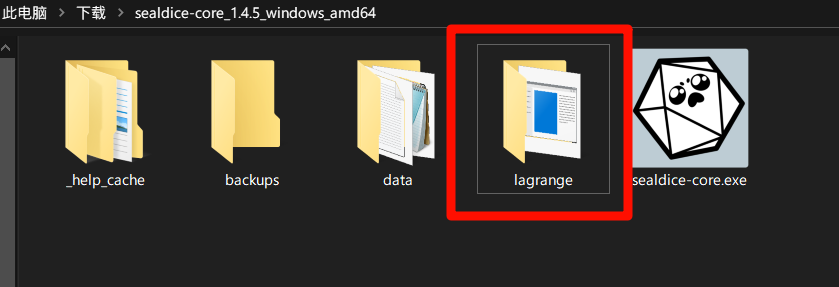
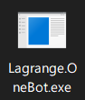

# 选择骰娘核心

要搭建骰娘第一步自然是选择骰娘核心了，接下来先简单介绍一下目前常用的有什么核心


| 核心名              | 时间   |
| ------------------- | ------ |
| [Dice!][]（溯洄）   | 2018年 |
| [SinaNya][]（塔骰） | 2019年 |
| [青果][]            | 2021年 |
| [Dicer][]           | 2023年 |
| [Seal][]（海豹）    | 2022年 |

> 注：这里的年份来自 [GitHub][] 仓库中最早提交日期


在这些核心中，海豹是个人认为最适合新手上手的，因此这里将使用海豹核心来搭建骰娘。

海豹官网：<https://dice.weizaima.com/>

# 部署海豹

## Windows 平台

### 下载海豹

在 Windows 平台中部署海豹非常容易。

首先在[下载连接](https://dice.weizaima.com/download)中下载自己电脑平台对应的核心[^1]，然后找到下载文件夹。


找到后解压在自己想解压的路径，然后直接双击打开海豹图标即可


在任务栏的右下角找到图标，打开菜单栏，点击打开界面即可。


### 添加账号

在账号设置中点击添加账号


在输入自己的QQ号后即可扫描二维码登录，在成功后就可以恭喜你，已经完成了第一步。

> 另外可以在“综合设置-基本设置中找到 Master 解锁码，将解锁码通过QQ发送给骰娘就可以方便的获取到 Master 权限。”

## Linux 平台

### 下载海豹

使用以下任意一条命令均可：

```bash
wget https://d1.sealdice.com/sealdice-core_1.4.5_linux_amd64.tar.gz
curl -o https://d1.sealdice.com/sealdice-core_1.4.5_linux_amd64.tar.gz
```

在下载完成后使用以下命令来解压缩：

```bash
tar -xzvf sealedice-core_1.4.5_linux_amd64.tar.gz
```

进入目录，给予权限后运行`sealdice-core`文件

```bash
cd ./sealdice-core
chmod +x ./sealdice-core
./sealdice-core
```

然后在浏览器使用 <localhost:3211> 来访问后台[^2]。

后见 Windows 的添加账号章节

## 手机平台

### 下载海豹

> 注意：手机平台上的海豹登录时需要使用[TIM](https://tim.qq.com/download.html)进行扫码

首先在浏览器进入[下载连接](https://dice.weizaima.com/download)，找到下载按钮


安装完成后进入海豹


先点击启动核心，然后再等待10秒后自动跳转到UI页面。


关于如何登录具体参考 Windows 章节的添加账号部分，唯一不同的地方是需要提前下载手机版本的[TIM](https://tim.qq.com/download.html)并且使用[TIM](https://tim.qq.com/download.html)来扫码登录。


# 海豹常见问题

## 无法登录

#### 一、内置 bug

由于海豹默认使用的核心为 [Lagrange](https://github.com/LagrangeDev/Lagrange.Core) 有一点bug可能会导致无法登录，常见于过多次关闭打开核心的状况。具体解决方法：

```
电脑：尝试删掉data/default/extra/lagrange-QQ号文件夹，重启海豹
手机：尝试停止海豹核心，在右上角设置那里把文件同步开一下，导出文件，到显示的目录删掉data/default/extra/lagrange-QQ号文件夹，然后导入，启动核心
```

#### 二、无法获取二维码

重新登录发现无法获取到二维码，并且终端报错“Onebot”进程启动失败，这时候你需要检查一下你的[Lagrange](https://github.com/LagrangeDev/Lagrange.Core)文件夹了。他的位置在海豹文件夹的 lagrange 内。



检查下`Lagrange.OneBot.exe`还在不在该文件夹里面，如果不在或误删了，可以在下载页面重新下载一个海豹，用里面的`Lagrange.OneBot.exe`替换进来。然后再重新启动海豹核心，获取二维码试试。




## 如何发送表情包/图片

由于海豹限制发送图片只能发送`/data/images`目录，所以你需要先把你要发的表情包复制进去，然后再使用例如：`[图:data/images/欢迎新人.jpg]`的格式来发送图片。


# 结语

感谢各位的观看，如果有什么问题可以发送邮件到<misaka12843@outlook.com>。如果文中有什么地方有误，烦请指教。本博客会定期更新，谢谢各位。


---

注释：

[^1]: 关于如何选择64位或32位，可以通过电脑内存来判断，使用`Esc+Shift+Control`进入任务管理器，点击`性能`，查看内存大小，小于等于4G内存建议使用32位版本。
[^2]: 如果你使用的是云服务器，`localhost`使用你的公网 ip 地址替代

[Dice!]: https://github.com/Dice-Developer-Team/Dice
[SinaNya]: https://sitcnya.gitbook.io/sinanya
[青果]: https://wiki.dice.center/
[Dicer]: https://dicer.noctisynth.org/
[GitHub]:https://www.github.com

